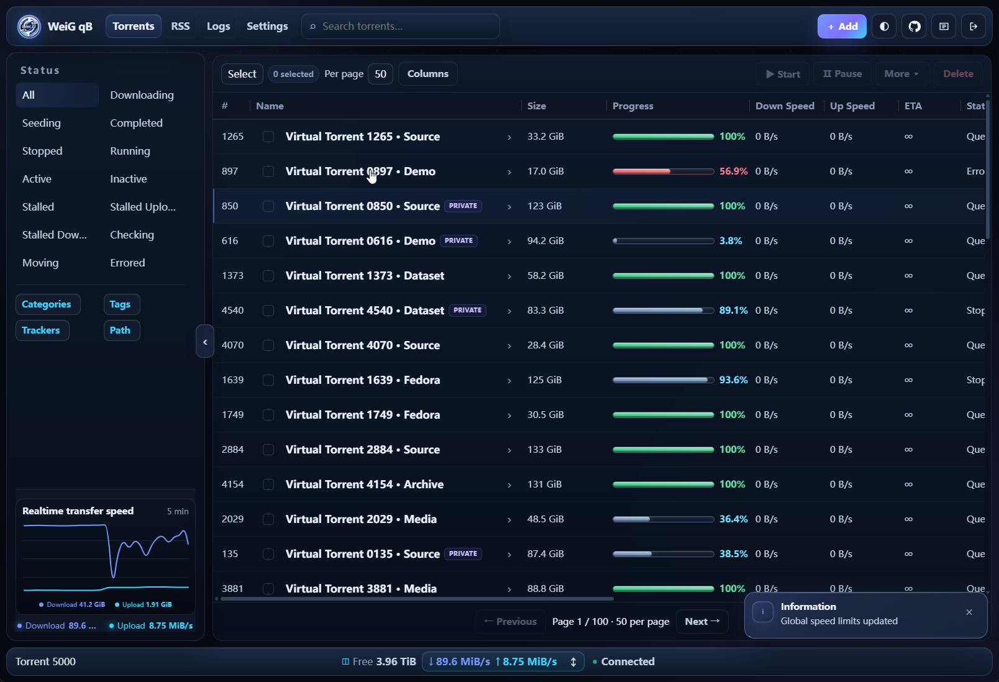
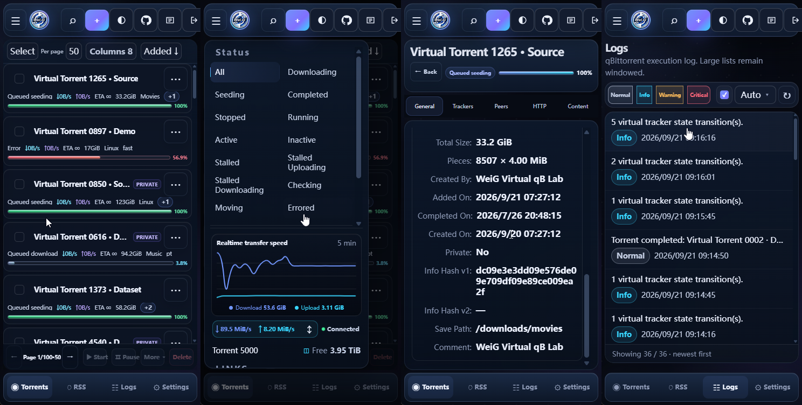

# WeiG qB WebUI

Eine moderne, responsive qBittorrent Alternate WebUI, optimiert für Desktop und Mobilgeräte.

**📱 Mobilfreundlich · 🌙 Dunkelmodus · ✅ Unterstützt qBittorrent 4.1.x → 5.2.x**

<p>
  
  
  
  
  
</p>

**[🌐 Online-Vorschau](https://weigefenxiang.github.io/WeiG-qB-WebUI/)** · **[⬇️ Neueste stabile Version herunterladen](https://github.com/weigefenxiang/WeiG-qB-WebUI/releases/latest/download/WeiG-qB-WebUI.zip)**

**Sprache**: [English](../README.md) · [简中](README.zh-CN.md) · [繁中](README.zh-TW.md) · [日本語](README.ja.md) · [한국어](README.ko.md) · **Deutsch** · [Français](README.fr.md) · [Español](README.es.md) · [Português](README.pt.md) · [Русский](README.ru.md)

## Direkt herunterladen

Lade die neueste stabile **[WeiG-qB-WebUI.zip](https://github.com/weigefenxiang/WeiG-qB-WebUI/releases/latest/download/WeiG-qB-WebUI.zip)** herunter.

Das ZIP enthält weiterhin den obersten Ordner `WeiG-qB-WebUI`. Benenne diesen lokalen Ordner nach dem Entpacken in **`WeiG_qB-WebUI`** um; dieser umbenannte Ordner ist das WebUI-Verzeichnis für qBittorrent.

## Oberflächenvorschau

### Desktop



### Mobil



## Installation für Einsteiger

<details>
<summary><b>Zum ersten Mal? 1-Minuten-Anleitung aufklappen</b></summary>

### 1. ZIP entpacken

Lade `WeiG-qB-WebUI.zip` herunter, entpacke es und benenne den entpackten Ordner `WeiG-qB-WebUI` anschließend in `WeiG_qB-WebUI` um. Danach sollte die Struktur so aussehen:

```text
WeiG_qB-WebUI/
├── public/
├── private/
├── VERSION
└── GIT_SHA
```

Der gesamte Ordner **`WeiG_qB-WebUI`** ist das WebUI-Stammverzeichnis. Nicht nur `public` oder `private` kopieren.

### 2. An einen festen Ort verschieben

Zum Beispiel:

```text
Windows: D:\WeiG_qB-WebUI
Linux:   /opt/WeiG_qB-WebUI
```

Diesen Pfad trägst du anschließend in qBittorrent ein.

### 3. In qBittorrent aktivieren

Öffne qBittorrent:

**Werkzeuge → Optionen ... → WebUI**

Das sind die aktuellen Begriffe der offiziellen deutschen qBittorrent-Oberfläche. Danach:

1. **Alternative Weboberfläche verwenden** aktivieren.
2. **Speicherort der Dateien:** suchen.
3. Den Pfad zum Ordner `WeiG_qB-WebUI` eintragen.

Windows-Beispiel:

```text
D:\WeiG_qB-WebUI
```

### Bestimmte Version und Installationsverzeichnis

Linux-Beispiel:

```text
/opt/WeiG_qB-WebUI
```

4. Mit **OK** speichern.
5. Die qBittorrent-WebUI neu laden. Falls die alte Ansicht im Cache bleibt, `Ctrl + F5` verwenden.

> **Pfad prüfen:** Im eingetragenen Ordner müssen `public`, `private`, `VERSION` usw. direkt sichtbar sein.

> **Docker:** qBittorrent läuft im Container. Deshalb muss in qBittorrent normalerweise ein container-sichtbarer Pfad eingetragen werden, nicht der Host-Pfad.

</details>

## Ein-Klick-Installation

Das Linux-/NAS-Installationsskript wird immer über den festen Dev-Pages-Link unten geladen. **Die Skriptadresse bestimmt nicht den Installationskanal:** ohne `-dev` wird die neueste geprüfte stabile GitHub-Release installiert; `-dev` ist nur für die aktuelle Entwicklungsversion.
### Linux / NAS

```sh
curl -fsSL https://weigefenxiang.github.io/WeiG-qB-WebUI/downloads/dev/install.sh -o weig_qb-webui_install.sh && sh weig_qb-webui_install.sh -configure
```

<details>
<summary><b>Skript- und Standard-Installationspfad anzeigen</b></summary>

```text
./weig_qb-webui_install.sh
```

Standardpfad der WebUI:

```text
~/.local/share/weig_qb-webui
```

Bei Ausführung als `root` typischerweise:

```text
/root/.local/share/weig_qb-webui
```

</details>

### Docker

<details>
<summary><b>Docker-Ein-Klick-Installation / mehrere Container / Pfade</b></summary>

#### Host und Container

- **Host**: das Linux-/NAS-System, auf dem Docker läuft.
- **Container**: die isolierte Umgebung, in der qBittorrent läuft.

Beispiel:

```text
Host:      /root/qbittorrent/config
   ↓ gemountet als
Container: /config
```

Docker Compose:

```yaml
volumes:
  - /root/qbittorrent/config:/config
```

Liegt die WebUI auf dem Host unter:

```text
/root/qbittorrent/config/weig_qb-webui
```

muss qBittorrent bei **Speicherort der Dateien:** verwenden:

```text
/config/weig_qb-webui
```

#### Ein qBittorrent-Container

```sh
curl -fsSL https://weigefenxiang.github.io/WeiG-qB-WebUI/downloads/dev/install.sh -o weig_qb-webui_install.sh && sh weig_qb-webui_install.sh -configure
```

Der Installer versucht Container und `/config`-Mount automatisch zu erkennen.

#### Container anzeigen

```sh
sh weig_qb-webui_install.sh --list-containers
```

Oder:

```sh
docker ps
```

Einen Container ausdrücklich wählen:

```sh
sh weig_qb-webui_install.sh --container=qbittorrent -configure
```

Bei mehreren qBittorrent-Containern wählt der Installer nicht automatisch einen aus.

#### Host-Pfad für `/config` angeben

```sh
sh weig_qb-webui_install.sh --config-root=/root/qbittorrent/config -configure
```

Synology-Beispiel:

```sh
sh weig_qb-webui_install.sh --config-root=/volume1/docker/qbittorrent -configure
```

Anderes NAS:

```sh
sh weig_qb-webui_install.sh --config-root=/share/Container/qbittorrent -configure
```

#### WebUI-Zielpfad festlegen

```sh
sh weig_qb-webui_install.sh --container=qbittorrent -o /config/weig_qb-webui -configure
```

</details>

### Windows PowerShell

```powershell
Invoke-WebRequest https://weigefenxiang.github.io/WeiG-qB-WebUI/downloads/dev/install.ps1 -OutFile .\weig_qb-webui_install.ps1; powershell -ExecutionPolicy Bypass -File .\weig_qb-webui_install.ps1 -configure
```

<details>
<summary><b>Installationspfad anzeigen</b></summary>

```text
C:\Users\<Benutzername>\AppData\Local\WeiG_qB-WebUI
```

</details>

## Häufige Optionen
PowerShell-Parameternamen unterscheiden nicht zwischen Groß- und Kleinschreibung.

| Zweck | Linux / Docker / NAS | Windows PowerShell |
|---|---|---|
| Neuester stabiler Release | Standard | Standard |
| Bestimmter Release | `-version 1.0.0` | `-version 1.0.0` |
| Entwicklungsstand | `-dev` | `-dev` |
| Zielordner | `-o /path` oder `-o /path` | `-o D:\path` oder `-output D:\path` |
| qBittorrent automatisch konfigurieren | `-configure` | `-configure` |
| Vorherige Installation wiederherstellen | `-rollback` | `-rollback` |
| Hilfe | `-help` | `-help` |
| Docker-Container wählen | `--container=NAME` | — |
| Docker-Container auflisten | `--list-containers` | — |
| Host-Pfad des Docker-`/config` angeben | `--config-root=/path` | — |

<details>
<summary><b>Hinweise: (zum Aufklappen klicken)</b></summary>

- Eine nicht vorhandene Version fällt **nicht** automatisch auf latest oder dev zurück.
- `-dev` kann nicht zusammen mit `-version` verwendet werden.

Linux-Beispiel:

```sh
sh weig_qb-webui_install.sh -version 1.0.0 -o /opt/weig_qb-webui -configure
```

Windows-Beispiel:

```powershell
powershell -ExecutionPolicy Bypass -File .\weig_qb-webui_install.ps1 -version 1.0.0 -o D:\WeiG_qB-WebUI -configure
```

### Rollback

Rollback:

```sh
sh weig_qb-webui_install.sh -rollback
```

```powershell
powershell -ExecutionPolicy Bypass -File .\weig_qb-webui_install.ps1 -rollback
```


</details>
## Weitere Hilfe

Docker, NAS, benutzerdefinierte Pfade, Aktualisierung und manuelle Installation: [Installations-, Upgrade- und Bereitstellungsanleitung](installation-guide/deployment-guide.de.md).

## Lizenz

[GNU General Public License v3](../LICENSE).

Copyright © 2026 Wei.G / WeiG Share.
