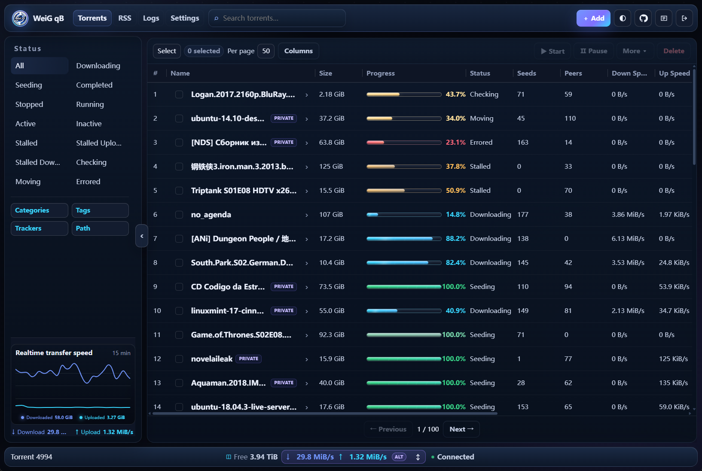
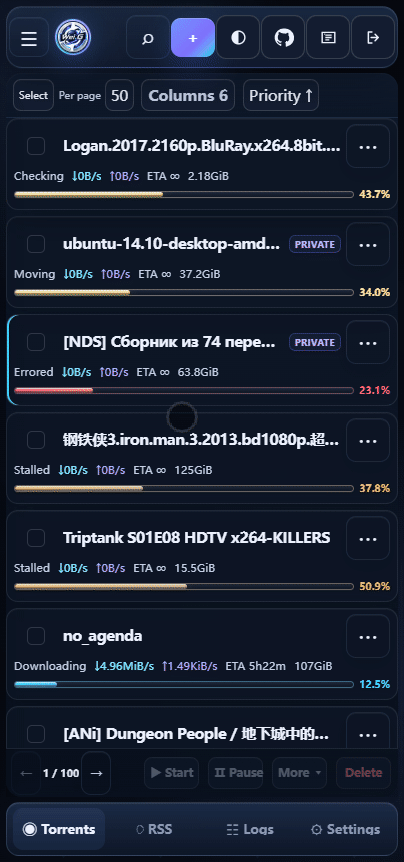
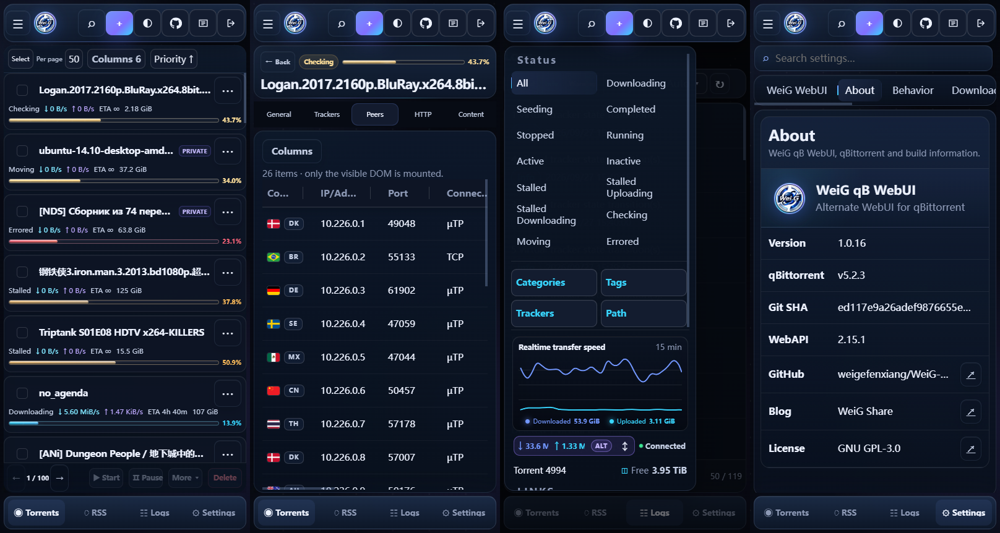

# WeiG qB WebUI

데스크톱과 모바일에 최적화된 현대적이고 반응형인 qBittorrent Alternate WebUI입니다.

**📱 모바일 친화적 · 🌙 다크 모드 · ✅ qBittorrent 4.1.x → 5.2.x 지원**

<p>
  
  
  
  
  
</p>

**[🌐 온라인 미리보기](https://weigefenxiang.github.io/WeiG-qB-WebUI/)** · **[⬇️ 최신 정식 버전 다운로드](https://github.com/weigefenxiang/WeiG-qB-WebUI/releases/latest)**

**언어**: [English](../README.md) · [简中](README.zh-CN.md) · [繁中](README.zh-TW.md) · [日本語](README.ja.md) · **한국어** · [Deutsch](README.de.md) · [Français](README.fr.md) · [Español](README.es.md) · [Português](README.pt.md) · [Русский](README.ru.md)

## 직접 다운로드

최신 안정 버전 **[weig-qb-webui.zip](https://github.com/weigefenxiang/WeiG-qB-WebUI/releases/latest)** 을 내려받습니다.

과거 immutable Release는 게시 당시의 원래 자산 이름을 그대로 유지합니다. 설치 프로그램은 명확히 제한된 호환 경로에서만 이러한 이전 이름을 읽습니다.

ZIP에는 표준 최상위 폴더 **`weig-qb-webui`** 가 이미 들어 있습니다. 압축을 푼 뒤 이름을 바꾸지 않고 이 폴더를 그대로 qBittorrent WebUI 디렉터리로 사용하면 됩니다.

## 인터페이스 미리보기

### 데스크톱

<p align="center">
  
</p>

### 모바일

<p align="center">
  
  
</p>

## 초보자 설치

<details>
<summary><b>처음 설치하나요? 1분 가이드 펼치기</b></summary>

### 1. 압축 풀기

`weig-qb-webui.zip`을 내려받아 압축을 풉니다. 압축 파일에서 표준 폴더가 그대로 생성됩니다:

```text
weig-qb-webui/
├── public/
├── private/
├── VERSION
└── GIT_SHA
```

**`weig-qb-webui` 전체 폴더**가 WebUI 루트입니다. `public`이나 `private`만 복사하지 마세요.

### 2. 고정된 위치로 이동

나중에 실수로 삭제하지 않을 위치에 전체 폴더를 옮깁니다.

```text
Windows: D:\weig-qb-webui
Linux:   /opt/weig-qb-webui
```

이 경로를 qBittorrent에 입력합니다.

### 3. qBittorrent에서 활성화

qBittorrent를 엽니다.

**도구 → 옵션… → WebUI**

현재 qBittorrent 공식 한국어 UI 용어입니다. 이어서:

1. **대체 WebUI 사용**을 켭니다.
2. **파일 위치:**를 찾습니다.
3. 저장한 `weig-qb-webui` 폴더 경로를 입력합니다.

Windows 예시:

```text
D:\weig-qb-webui
```

Linux 예시:

```text
/opt/weig-qb-webui
```

4. **확인/OK**을 눌러 저장합니다.
5. qBittorrent WebUI 페이지를 새로고침합니다. 이전 화면이 남으면 `Ctrl + F5`를 눌러 보세요.

> **경로가 맞는지 확인하는 방법:** 입력한 폴더 안에 `public`, `private`, `VERSION` 등이 바로 보여야 합니다.

> **Docker 사용자:** qBittorrent는 컨테이너 안에서 실행되므로 호스트 경로를 그대로 입력할 수 없는 경우가 많습니다. 아래 Docker 안내를 확인하세요.

</details>

## 원클릭 설치

Linux / NAS 원클릭 설치 스크립트는 아래의 고정 Dev Pages 주소에서 내려받습니다. **스크립트 주소가 설치 채널을 결정하지 않습니다:** `-dev`를 붙이지 않으면 검증된 최신 안정 Release를 설치하며, 현재 개발 버전을 시험할 때만 `-dev`를 사용합니다.

### Linux / NAS

```sh
curl -fsSL https://weigefenxiang.github.io/WeiG-qB-WebUI/downloads/dev/install.sh -o install.sh && sh install.sh -configure
```

<details>
<summary><b>스크립트 위치와 기본 WebUI 설치 경로 보기</b></summary>

```text
./install.sh
```

기본 WebUI 설치 경로:

```text
~/.local/share/weig-qb-webui
```

`root`로 실행한 경우 일반적으로:

```text
/root/.local/share/weig-qb-webui
```

</details>

### Docker

<details>
<summary><b>Docker 원클릭 설치 / 여러 컨테이너 / 경로 설명</b></summary>

#### 호스트와 컨테이너

- **호스트**: Docker가 실제로 실행되는 Linux/NAS 시스템입니다.
- **컨테이너**: qBittorrent가 실행되는 Docker 환경입니다.

예를 들어:

```text
호스트:      /root/qbittorrent/config
   ↓ 매핑
컨테이너:    /config
```

Docker Compose 예시:

```yaml
volumes:
  - /root/qbittorrent/config:/config
```

WebUI가 호스트의:

```text
/root/qbittorrent/config/weig-qb-webui
```

에 설치되었다면 qBittorrent의 **파일 위치:**에는:

```text
/config/weig-qb-webui
```

를 입력해야 합니다.

#### qBittorrent 컨테이너가 하나뿐인 경우

```sh
curl -fsSL https://weigefenxiang.github.io/WeiG-qB-WebUI/downloads/dev/install.sh -o install.sh && sh install.sh -configure
```

설치기가 실행 중인 qBittorrent 컨테이너와 `/config` 매핑을 자동으로 찾습니다.

#### 컨테이너 목록 보기

```sh
sh install.sh --list-containers
```

또는:

```sh
docker ps
```

`qbittorrent`를 명시적으로 선택:

```sh
sh install.sh --container=qbittorrent -configure
```

여러 컨테이너가 있으면 설치기는 임의로 선택하지 않습니다.

#### 호스트의 `/config` 경로를 알고 있는 경우

```sh
sh install.sh --config-root=/root/qbittorrent/config -configure
```

Synology 예시:

```sh
sh install.sh --config-root=/volume1/docker/qbittorrent -configure
```

다른 NAS 예시:

```sh
sh install.sh --config-root=/share/Container/qbittorrent -configure
```

#### WebUI 경로 지정

```sh
sh install.sh --container=qbittorrent -o /config/weig-qb-webui -configure
```

</details>

### Windows PowerShell

```powershell
Invoke-WebRequest https://weigefenxiang.github.io/WeiG-qB-WebUI/downloads/dev/install.ps1 -OutFile .\install.ps1; powershell -ExecutionPolicy Bypass -File .\install.ps1 -configure
```

<details>
<summary><b>설치 경로 보기</b></summary>

```text
C:\Users\<사용자 이름>\AppData\Local\weig-qb-webui
```

</details>

## 자주 쓰는 옵션
PowerShell 매개변수 이름은 대소문자를 구분하지 않습니다.

| 용도 | Linux / Docker / NAS | Windows PowerShell |
|---|---|---|
| 최신 정식 버전 | 기본값 | 기본값 |
| 특정 Release | `-version 1.0.0` | `-version 1.0.0` |
| 개발 버전 | `-dev` | `-dev` |
| 설치 경로 지정 | `-o /path` 또는 `-o /path` | `-o D:\path` 또는 `-output D:\path` |
| qBittorrent 자동 설정 | `-configure` | `-configure` |
| 이전 설치로 롤백 | `-rollback` | `-rollback` |
| 완전 제거(설치 프로그램 백업 미보관) | `-uninstall -purge` | `-uninstall -purge` |
| 도움말 | `-help` | `-help` |
| Docker 컨테이너 지정 | `--container=NAME` | — |
| Docker 컨테이너 목록 | `--list-containers` | — |
| Docker `/config` 호스트 경로 지정 | `--config-root=/path` | — |

<details>
<summary><b>설명: (클릭하여 펼치기)</b></summary>

- 존재하지 않는 `-version`은 latest나 dev로 자동 전환되지 않습니다.
- `-dev`와 `-version`은 함께 사용할 수 없습니다.

### 특정 버전과 설치 디렉터리

Linux 예시:

```sh
sh install.sh -version 1.0.0 -o /opt/weig-qb-webui -configure
```

Windows 예시:

```powershell
powershell -ExecutionPolicy Bypass -File .\install.ps1 -version 1.0.0 -o D:\weig-qb-webui -configure
```

### 롤백

롤백:

```sh
sh install.sh -rollback
```

```powershell
powershell -ExecutionPolicy Bypass -File .\install.ps1 -rollback
```

</details>

## 원클릭 제거

<details>
<summary><b>Linux / NAS, Docker, Windows PowerShell 완전 제거</b></summary>

기본적으로 **설치 프로그램 백업을 남기지 않는 완전 제거**를 권장합니다. WebUI를 제거하고 현재 대상의 대체 WebUI 설정을 비활성화한 뒤, 해당 대상의 installer-owned backups / rollback 상태와 현재 디렉터리의 설치 스크립트까지 정리합니다.

### Linux / NAS

```sh
sh install.sh -uninstall -configure -purge && rm -f -- ./install.sh
```

사용자 지정 설치 경로라면 `-o /path/to/weig-qb-webui`를 추가하세요.

### Docker

단일 컨테이너 자동 감지:

```sh
sh install.sh -uninstall -configure -purge && rm -f -- ./install.sh
```

여러 컨테이너:

```sh
sh install.sh -uninstall -configure -purge --container=qbittorrent && rm -f -- ./install.sh
```

`--config-root` 사용 시:

```sh
sh install.sh -uninstall -configure -purge --config-root=/path/to/qbittorrent/config && rm -f -- ./install.sh
```

### Windows PowerShell

```powershell
powershell -ExecutionPolicy Bypass -File .\install.ps1 -uninstall -configure -purge; if ($LASTEXITCODE -eq 0) { Remove-Item .\install.ps1 -Force }
```

사용자 지정 설치 경로라면 `-o D:\weig-qb-webui`를 추가하세요.

`-purge`는 현재 제거 대상이 소유한 백업만 삭제하며 다른 설치의 백업은 건드리지 않습니다. 공유 상태 디렉터리가 비면 Linux의 `~/.config/weig_qb-webui`(root는 `/root/.config/weig_qb-webui`) 또는 Windows의 `%APPDATA%\WeiG_qB-WebUI`도 함께 제거됩니다.

나중에 `-rollback`을 위해 백업을 남기려면 `-purge`만 빼면 됩니다.

</details>

## 추가 도움말

Docker, NAS, 사용자 지정 경로, 업데이트 및 수동 배포는 [설치, 업그레이드 및 수동 배포](installation-guide/deployment-guide.ko.md)를 참고하세요.

## 라이선스

[GNU General Public License v3](../LICENSE).

Copyright © 2026 Wei.G / WeiG Share.
