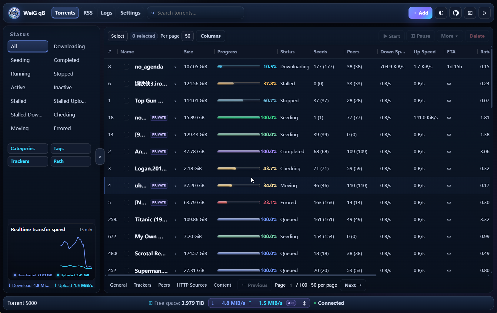
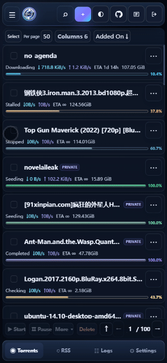
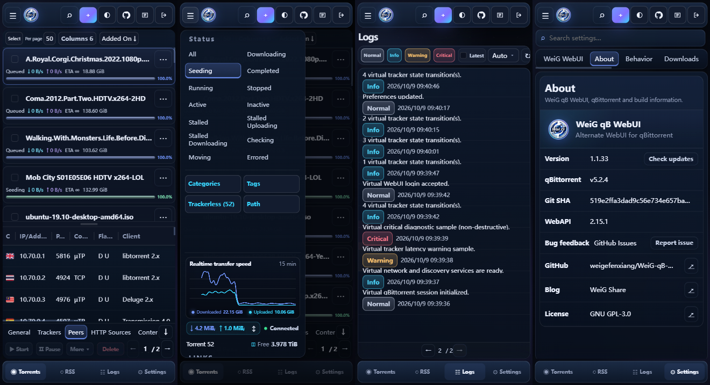

# WeiG qB WebUI

Современный адаптивный Alternate WebUI для qBittorrent, оптимизированный для компьютеров и мобильных устройств.

**📱 Удобно на мобильных устройствах · 🌙 Тёмная тема · ✅ Поддержка qBittorrent 4.1.x → 5.2.x**

<p>
  
  
  
  
  
</p>

**[🌐 Онлайн-просмотр](https://weigefenxiang.github.io/WeiG-qB-WebUI/)** · **[⬇️ Скачать последнюю стабильную версию](https://github.com/weigefenxiang/WeiG-qB-WebUI/releases/latest)**

**Язык**: [English](../README.md) · [简中](README.zh-CN.md) · [繁中](README.zh-TW.md) · [日本語](README.ja.md) · [한국어](README.ko.md) · [Deutsch](README.de.md) · [Français](README.fr.md) · [Español](README.es.md) · [Português](README.pt.md) · **Русский**

## Прямая загрузка

Скачайте последнюю стабильную версию [**weig-qb-webui.zip**](https://github.com/weigefenxiang/WeiG-qB-WebUI/releases/latest). Этот же ZIP-архив подходит для Linux и NAS.

## Предпросмотр интерфейса

### Настольная версия

<p align="center">
  
</p>

### Мобильная версия

<p align="center">
  
</p>

## Установка для начинающих

<details>
<summary><b>Устанавливаете впервые? Откройте минутную инструкцию</b></summary>

### 1. Распакуйте ZIP

Скачайте `weig-qb-webui.zip` и распакуйте архив. Он уже создаёт каноническую папку:

```text
weig-qb-webui/
├── public/
├── private/
├── VERSION
└── GIT_SHA
```

Вся папка **`weig-qb-webui`** является корнем WebUI. Не копируйте только `public` или `private`.

### 2. Переместите в постоянное место

Например:

```text
Windows: D:\weig-qb-webui
Linux:   /opt/weig-qb-webui
```

Этот путь затем нужно указать в qBittorrent.

### 3. Включите в qBittorrent

Откройте qBittorrent:

**Сервис → Настройки… → WebUI**

Это текущие термины официального русского перевода qBittorrent. Затем:

1. Включите **Использовать альтернативный веб-интерфейс**.
2. Найдите **Расположение файлов:**.
3. Укажите путь к папке `weig-qb-webui`.

Пример Windows:

```text
D:\weig-qb-webui
```

Пример Linux:

```text
/opt/weig-qb-webui
```

4. Нажмите **OK** для сохранения.
5. Обновите страницу WebUI. Если осталась старая версия из кэша, попробуйте `Ctrl + F5`.

> **Проверка пути:** в указанном каталоге должны сразу быть видны `public`, `private`, `VERSION` и другие файлы.

> **Docker:** qBittorrent работает внутри контейнера, поэтому обычно нужно указывать путь, видимый из контейнера, а не реальный путь хоста.

</details>

## Установка одной командой

Однокликовый установщик для Linux/NAS всегда загружается по фиксированному адресу Dev Pages ниже. **Адрес скрипта не определяет канал установки:** без `-dev` устанавливается последний проверенный стабильный Release; `-dev` используется только для текущей версии разработки.

### Linux / NAS

```sh
curl -fsSL https://weigefenxiang.github.io/WeiG-qB-WebUI/downloads/dev/install.sh -o install.sh && sh install.sh -configure
```

<details>
<summary><b>Показать путь скрипта и каталог установки по умолчанию</b></summary>

```text
./install.sh
```

Каталог WebUI по умолчанию:

```text
~/.local/share/weig-qb-webui
```

При запуске от `root` обычно:

```text
/root/.local/share/weig-qb-webui
```

</details>

### Docker

<details>
<summary><b>Docker / несколько контейнеров / объяснение путей</b></summary>

#### Хост и контейнер

- **Хост**: Linux/NAS, на котором запущен Docker.
- **Контейнер**: изолированная среда, где работает qBittorrent.

Пример:

```text
Хост:       /root/qbittorrent/config
   ↓ смонтировано как
Контейнер:  /config
```

Docker Compose:

```yaml
volumes:
  - /root/qbittorrent/config:/config
```

Если WebUI на хосте находится здесь:

```text
/root/qbittorrent/config/weig-qb-webui
```

то в **Расположение файлов:** qBittorrent нужно указать:

```text
/config/weig-qb-webui
```

#### Один контейнер qBittorrent

```sh
curl -fsSL https://weigefenxiang.github.io/WeiG-qB-WebUI/downloads/dev/install.sh -o install.sh && sh install.sh -configure
```

Установщик попытается автоматически определить контейнер и монтирование `/config`.

#### Показать контейнеры

```sh
sh install.sh --list-containers
```

Или:

```sh
docker ps
```

Явно выбрать контейнер:

```sh
sh install.sh --container=qbittorrent -configure
```

Если найдено несколько контейнеров qBittorrent, установщик не выбирает один случайно.

#### Если запущено несколько контейнеров qBittorrent

Установщик не выбирает контейнер случайным образом. Посмотрите список и укажите нужный контейнер явно — каждую команду установки запускайте отдельно:

```sh
sh install.sh --list-containers
sh install.sh --container=qbittorrent -configure
sh install.sh --container=qbittorrent-test -configure
```

#### Указать путь хоста, смонтированный как `/config`

```sh
sh install.sh --config-root=/root/qbittorrent/config -configure
```

Synology:

```sh
sh install.sh --config-root=/volume1/docker/qbittorrent -configure
```

Другой NAS:

```sh
sh install.sh --config-root=/share/Container/qbittorrent -configure
```

#### Указать путь WebUI

```sh
sh install.sh --container=qbittorrent -o /config/weig-qb-webui -configure
```

#### Обновление нескольких установок WebUI за один запуск

В Linux и на NAS можно повторить параметр `-o` и обновить несколько существующих установок после одной загрузки. В этом режиме нельзя одновременно использовать `-configure`, `--container` и `--config-root`.

```sh
sh install.sh -o /opt/weig-qb-webui -o /srv/qb/weig-qb-webui
```

#### Как проверить пути после установки

Установщик показывает путь на хосте и путь, доступный самому qBittorrent:

```text
Host install path: /root/qbittorrent/config/weig-qb-webui
qBittorrent Root Folder: /config/weig-qb-webui
```

В настройке qBittorrent **Files location** следует использовать второй путь — внутри контейнера. При успешном выполнении `-configure` установщик задаёт его автоматически.

</details>

### Windows PowerShell

```powershell
Invoke-WebRequest https://weigefenxiang.github.io/WeiG-qB-WebUI/downloads/dev/install.ps1 -OutFile .\install.ps1; powershell -ExecutionPolicy Bypass -File .\install.ps1 -configure
```

<details>
<summary><b>Показать каталог установки</b></summary>

```text
C:\Users\<имя-пользователя>\AppData\Local\weig-qb-webui
```

</details>

## Основные параметры
Имена параметров PowerShell не зависят от регистра.

| Назначение | Linux / Docker / NAS | Windows PowerShell |
|---|---|---|
| Последний стабильный Release | По умолчанию | По умолчанию |
| Конкретный Release | `-version 1.2.0` | `-version 1.2.0` |
| Версия разработки | `-dev` | `-dev` |
| Каталог установки | `-o /path` или `-o /path` | `-o D:\path` или `-output D:\path` |
| Указать файл настроек qBittorrent | — | `-qbconfig D:\path\qBittorrent.ini` |
| Автоматически настроить qBittorrent | `-configure` | `-configure` |
| Откатить предыдущую установку | `-rollback` | `-rollback` |
| Полное удаление (не сохранять резервные копии установщика) | `-uninstall -purge` | `-uninstall -purge` |
| Справка | `-help` | `-help` |
| Выбрать Docker-контейнер | `--container=NAME` | — |
| Показать Docker-контейнеры | `--list-containers` | — |
| Путь хоста, смонтированный как `/config` | `--config-root=/path` | — |

<details>
<summary><b>Примечания: (нажмите, чтобы раскрыть)</b></summary>

- Несуществующая версия не переключается автоматически на latest или dev.
- `-dev` нельзя использовать вместе с `-version`.

### Конкретная версия и каталог установки

Linux:

```sh
sh install.sh -version 1.2.0 -o /opt/weig-qb-webui -configure
```

Windows:

```powershell
powershell -ExecutionPolicy Bypass -File .\install.ps1 -version 1.2.0 -o D:\weig-qb-webui -configure
```

### Откат

Откат:

```sh
sh install.sh -rollback
```

```powershell
powershell -ExecutionPolicy Bypass -File .\install.ps1 -rollback
```

</details>

## Удаление одной командой

<details>
<summary><b>Полное удаление для Linux / NAS, Docker и Windows PowerShell</b></summary>

По умолчанию рекомендуется **полное удаление без сохранения резервных копий установщика**: удалить WebUI, отключить соответствующий альтернативный WebUI, очистить принадлежащие этой цели резервные копии / состояние rollback, а затем удалить загруженный скрипт установки из текущего каталога.

### Linux / NAS

```sh
sh install.sh -uninstall -configure -purge && rm -f -- ./install.sh
```

Для собственного пути установки добавьте `-o /path/to/weig-qb-webui`.

### Docker

Один контейнер / автоопределение:

```sh
sh install.sh -uninstall -configure -purge && rm -f -- ./install.sh
```

Несколько контейнеров:

```sh
sh install.sh -uninstall -configure -purge --container=qbittorrent && rm -f -- ./install.sh
```

При использовании `--config-root`:

```sh
sh install.sh -uninstall -configure -purge --config-root=/path/to/qbittorrent/config && rm -f -- ./install.sh
```

### Windows PowerShell

```powershell
powershell -ExecutionPolicy Bypass -File .\install.ps1 -uninstall -configure -purge; if ($LASTEXITCODE -eq 0) { Remove-Item .\install.ps1 -Force }
```

Для собственного пути установки добавьте `-o D:\weig-qb-webui`.

`-purge` удаляет только резервные копии текущей цели и не затрагивает другие установки. Если общий каталог состояния становится пустым, также удаляется `~/.config/weig-qb-webui` в Linux (для root: `/root/.config/weig-qb-webui`) или `%APPDATA%\weig-qb-webui` в Windows.

Чтобы сохранить резервные копии для последующего `-rollback`, просто уберите `-purge`.

</details>

## Дополнительная помощь

Docker, NAS, пользовательские пути, обновление и ручное развёртывание: [Установка, обновление и ручное развёртывание](installation-guide/deployment-guide.ru.md).

## Лицензия

[GNU General Public License v3](../LICENSE).

Copyright © 2026 Wei.G / WeiG Share.
